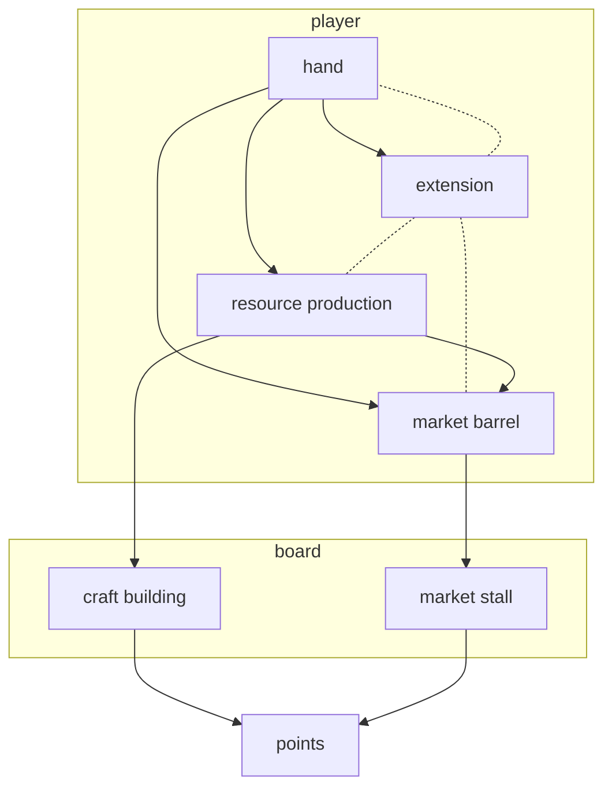

# test
* List
* Item 2

{{my-first-post.md}}

* Another list
* Second item
* [Test](another.md)

```mermaid 
graph TD 

subgraph board
MS[market stall]
CB[craft building]
end

subgraph player
MB[market barrel]
H[hand]
RP[resource production]
X[extension]
end

P[points]

H-->RP 
H-->MB
H-->X
X-.-H
X-.-MB
X-.-RP
RP-->CB
RP-->MB
MB-->MS
CB-->P
MS-->P
```